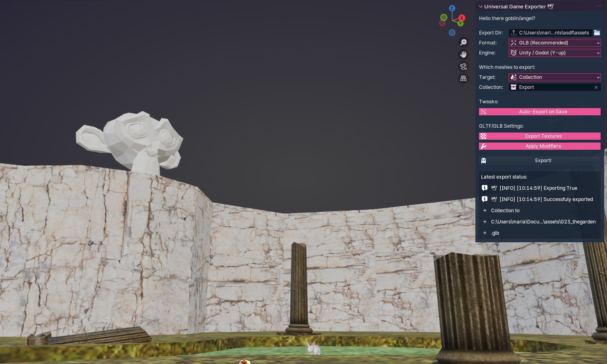

# blender-2-game-engine-4-goblins

*Tired of manual Blender exports whenever you want to see changes in your game engine? You've come to the right place!*

An auto glTF export tool for syncing Blender with [game engines](#supported-game-engines).

Please check out [disclaimer](#disclaimer) below.

## Installation

1. Go to the `Releases` and there you can find the latest extension version in form of a `.zip` file.
2. Add it in Blender through `Edit -> Preferences -> Add-ons -> (Arrow Down) Install from Disk...`

Thats's it, it will auto load on startup each time now.

## Supported game engines
- Unity: I'm using it daily, most tested.
  - 🎯 Important! You need to install an official Unity package [glTFast](https://docs.unity3d.com/Packages/com.unity.cloud.gltfast@6.0/manual/index.html) to work with `gLTF` fileformats in Unity.
  - https://github.com/KhronosGroup/UnityGLTF Kronos themselves also provide an importer/exporter of gltf files for Unity, but the official Unity one might be an easier plug and play solution for most cases.
- Godot: Works out of the box, GLTF is a preferred 3D fileformat for Godot, cool!
- Unreal Engine: Has native support for GLTF since 4.26, at least thats what chatty says.

## Why?
I used to work a lot in Unity with [ProBuilder](https://docs.unity3d.com/Packages/com.unity.probuilder@6.0/manual/index.html), because it was nice to work with models directly in Unity Editor, but Unity somehow messed up it's UI in my opinion. So I thought it is time to get back to Blender ✨, but Unity doesn't auto-import `.blend` files for Blender 4, even throws annoying warnings about it and I really dislike the repeated process to manually go to export menu whenever I want to see the model in Unity as I like to do it often, enter playmode and walk around it.

### 👓 TLDR; Working in blender and seeing results in Unity (almost) immediately (even in playmode!).

## How To Use
It comes in a form of an n-toolbar menu.
- Open up the 3D ViewPort
- Open the "N-Toolbar" (press the `N` key)
- Press the `🕊️ Uni Exp` tab
  - ℹ️💬 All of the elements in the panel contain additional usage info when hovered.
- Select `Auto-Export on Save` to have model exported into your target directory whenever you save the Blender project. `The idea here is that this directory is somewhere within your Unity project's Assets/ directory so that a scene using that exported mesh will reflect changes immediately upon a save in Blender.`
  - ⚠️💬 Obviously `Auto-Export on Save` will permanently overwrite the previously exported mesh file! 

### Why no FBX?

- Too much hassle to set up, especially for a variety of game engines.
- I always seem to have more orientation/scaling problems when exporting `FBX` meshes from Blender.
- `glTF` has usually smaller filesizes
- `glTF` is an open file format (fbx is a proprietary, owned by Autodesk)
- `glTF` has cooler export options in Blender (like [Draco Malfoy](https://google.github.io/draco/) mesh compression)
- If you need `FBX` you can probs be very 'appy with this addon instead: https://github.com/Wildergames/blender-quick-exporter

## Features

### TODO: Export Groups
Currently only one .glb can be exported at the time, with a given name and selection target. It would be nice to rework it as export groups so a bunch of meshes could be exported at once.

### Split mesh by `Vertex Group`
If you create a `Vertex Group` with a name `Vertex` on any of the exported meshes, this mesh will be split into `.base` and `.vertex` versions of it. This is useful if you need to keep backfaces but do not want them to waste lightmap atlas space and instead bake some of the mesh lighting info into vertex color. (In Unity this can be done with `Bakery` plugin.)

TODO: This is very situational, but it could be extended into a set-yourself vertex group setting that will split the mesh according to those groups while allowing you to work on a single mesh.

## Disclaimer
I'm mostly a C# programmer, so this plugin was made unter chatty's (ChatGPT) guide, it was a trial and error process, I learned a bunch about python and blender scripting, so it is an altogether fun ride and I am also happy with the results and can finally abandon ProBuilder for good.

Taking that into consideration this is by no means a professional battle-proven addon, might slowly grow into one, mostly a tool to rapidly prototype simple environments in blender to see changes almost instantly reflected unity in a possibly seamless way.

There are a bunch of code comments that explain to myself for future what some of the things do, I hope this is not too clumsy!

Used theme: https://extensions.blender.org/themes/alien-pink-theme/